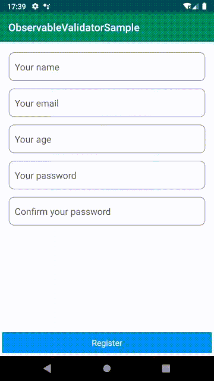

# Observable Binding Validator

[](https://jitpack.io/#thalisvilela/ObservableValidator)

ObservableValidator makes it very easy to validate input fields using the databinding framework, together with Observable fields.
## Download

Step 1: Add it in your root build.gradle at the end of repositories:

```
allprojects {
  repositories {
    ...
    maven { url 'https://jitpack.io' }
  }
}
```

Step 2: Add the dependency
```
  dependencies {
    implementation 'com.github.thalisvilela:ObservableValidator:LATEST-VERSION'
  }
```
Latest Version: [](https://jitpack.io/#thalisvilela/ObservableValidator)


## Features up to now:

* Validate Required Fields;
* Validate email;
* Validate min and max (if its string check lenght, if int, well, check the value);
* Validate "match" fields;
* You can use [`TextInputLayout`](https://developer.android.com/reference/android/support/design/widget/TextInputLayout.html), [`TextInputEditText`](https://developer.android.com/reference/android/support/design/widget/TextInputEditText.html) and EditText;

## Sample Use



## How to use it

### Enabling Data Binding ###

You need to enable Data Binding to use this library, add the following code into your main module's `build.gradle`:

```
android {
    ....
    dataBinding {
        enabled = true
    }
}
```
### Setting up the Observable model ###
```
class RegisterUser:BaseObservable(){
    @Bindable
    var name:String?=""
        set(value) {
            field = value
            notifyPropertyChanged(BR.name)
        }

    @Bindable
    var email:String?=""
        set(value) {
            field = value
            notifyPropertyChanged(BR.email)
        }
}
```

### Setting up validations on ViewModel ###
You just have to create a new instance of  `ObservableValidator`, passing your Observable model and your `BR` (BindingResource auto generated class). Then, all you have to do is to add your rules like so:
```
class RegisterViewModel : ViewModel() {

    var user:LiveData<RegisterUser> = MutableLiveData<RegisterUser>().also {
        it.value = RegisterUser()
    }

    var validator = ObservableValidator(user.value!!, BR::class.java).apply {
        addRule("name", ValidationFlags.FIELD_REQUIRED, "Enter your name")

        addRule("email", ValidationFlags.FIELD_REQUIRED, "Enter your email")
        addRule("email", ValidationFlags.FIELD_EMAIL, "Enter a valid email")

        addRule("age", ValidationFlags.FIELD_REQUIRED, "Enter your age (Underage or too old?)")
        addRule("age", ValidationFlags.FIELD_MIN, "You can't be underage!", limit = 18)
        addRule("age", ValidationFlags.FIELD_MAX, "You sure you're still alive?", limit = 100)

        addRule("password", ValidationFlags.FIELD_REQUIRED, "Enter your password")

        addRule("passwordConfirmation", ValidationFlags.FIELD_REQUIRED, "Enter password confirmation")
        addRule("passwordConfirmation", ValidationFlags.FIELD_MATCH, "Passwords don't match", "password")
    }

}
```


### Setting up layout xml file ###

Just bind the error property of your `TextInputLayout`, `TextInputEditText` or `EditText`, to the method `validator.getValidation("fieldName")`. As all these widgets have the method setError by default, there's no need to create any custom `@BindingAdapter`

```
<com.google.android.material.textfield.TextInputLayout
    style="@style/textFieldOutlined"
    error='@{viewModel.validator.getValidation("email")}'
    android:layout_width="match_parent"
    android:layout_height="wrap_content">

    <com.google.android.material.textfield.TextInputEditText
        android:id="@+id/email"
        style="@style/myEditText"
        android:layout_width="match_parent"
        android:layout_height="wrap_content"
        android:hint="Your email"
        android:imeOptions="actionNext"
        android:inputType="textEmailAddress"
        android:text="@={viewModel.user.email}" />
</com.google.android.material.textfield.TextInputLayout>
```

#### And Voilá!!! ####

The validation should work as expected. you can force validation of all fields and check if all rules have passed, and  using:

```
validator.validateAll()
```


## License ##

    Copyright 2019-present Thalis Vilela/Umobi

    Licensed under the Apache License, Version 2.0 (the "License");
    you may not use this file except in compliance with the License.
    You may obtain a copy of the License at

       http://www.apache.org/licenses/LICENSE-2.0

    Unless required by applicable law or agreed to in writing, software
    distributed under the License is distributed on an "AS IS" BASIS,
    WITHOUT WARRANTIES OR CONDITIONS OF ANY KIND, either express or implied.
    See the License for the specific language governing permissions and
    limitations under the License.
